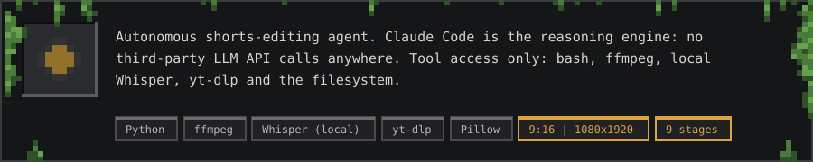

10-second tour: Intake → Plan → Fetch → Retrieve → Assemble → Caption → Score → Render → QA

<h2></h2>

Give it a source clip and a brief. It plans the story and pacing, fetches the footage, transcribes it locally, burns in word-level captions, picks music that matches the mood and tempo, and renders a vertical 9:16 short (1080x1920), then runs a QA pass.

<h2></h2>

Nine stages, run by `editor/agent/pipeline.py`:

`intake` → `plan` → `fetch` → `retrieve` → `assemble` → `caption` → `score` → `render` → `qa`

Behaviour is driven by three written rule sets rather than hidden prompts:

| File | Covers |
|---|---|
| `editor/agent/planner.md` | Story and pacing rules (P1-P13) |
| `editor/agent/caption_rules.md` | Word overlay style and timing (C1-C12) |
| `editor/agent/music_rules.md` | Song, BPM and mood matching (M1-M10) |

<h2></h2>

- **Memes:** Hindi, Kannada, Instagram-viral, movie-viral and African clip metadata
- **Music:** 16 tracks with an index (CC BY 4.0, attribution required, see `editor/NOTICE.md`)
- **Templates:** reusable edit templates
- A legal gate keeps assets out of public renders until their source and license are confirmed

<h2></h2>

Whisper runs locally, footage comes through yt-dlp, and captions are rendered as Pillow PNG overlays composited with ffmpeg, so it works with a minimal ffmpeg build.

<h2></h2>

Everything lives in [`editor/`](editor/). See [`editor/README.md`](editor/README.md) for the full layout, status and usage, and [`editor/NOTICE.md`](editor/NOTICE.md) for third-party asset licenses before publishing any render.

<h2></h2>

MIT for the code (see [`editor/LICENSE`](editor/LICENSE)). Bundled music and other assets carry their own terms.

